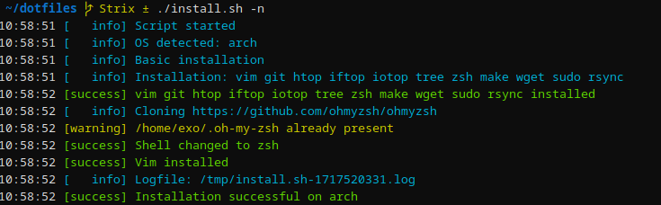

## ⚙️ Dotfiles
My configuration files, samples, and helpers

### 🪄 Automatic installation script

*install.sh* is a POSIX Shell script created to automatically install basic tools and set the user configuration

#### Run the script install.sh to
1. Install vim git htop iftop iotop tree zsh make wget sudo rsync curl
2. Set up zsh with ohmyzsh.git and the local configuration files (zsh will be switched as default shell)
3. Set up vim configuration files with plugins
4. (Optionnal Arch only) install packages from arch-package-list, and set the windows manager (wayland + sway)

#### Script usage
```
install.sh [OPTIONS]:
-d     Use debug mode
-l     Set log path (default /tmp)
-n     Skip all user interaction.  Implied 'No' to all actions
-h     Display this help and exit
```

#### Example


#### Tested on
* Alpine
* Arch (wm conf 🐮 available)
* Debian 12+
* Fedora 40+
* Manjaro
* Ubuntu 24+
* Linux Mint 22+

Install testing tool available on *docker_conf/install_test*

### 📝 TODO
- [ ] Docker nginx: fignoler le poro
- [ ] Waybar : redo iostat
