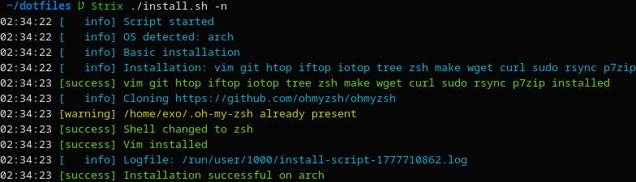

## ⚙️ Dotfiles
My configuration files, samples, and helpers

### 🪄 Automatic installation script

To automatically install my default environment run *install.sh* (POSIX Shell)

#### Run the script to
1. Install vim git htop iftop iotop tree zsh make wget curl sudo rsync p7zip
2. Set up zsh
3. Set up vim
4. (Optionnal Arch only) install packages from arch-package-list, and the windows manager (wayland + sway)

#### Script usage
```
install.sh [OPTIONS]:
-d     Use debug mode
-l     Set log path (default /tmp)
-n     Skip user interaction.  Implied 'No' to every actions
-h     Display this output
```

#### Example


#### Tested on
* Alpine
* Arch (wm conf 🐮 available)
* Debian 12+
* Fedora 40+
* Manjaro
* Ubuntu 24+
* Linux Mint 22+

Install testing tool available on *docker_conf/install_test*

### 📝 TODO
- [x] Docker mail_server : restore originals ports
- [ ] Docker : switch manager script solution with systemd + autoheal
- [ ] Docker : check all healthchecks
- [x] Docker filebrowser : add config file to volume
- [ ] Docker mail_server : run ipv6 blocker with docker-run
